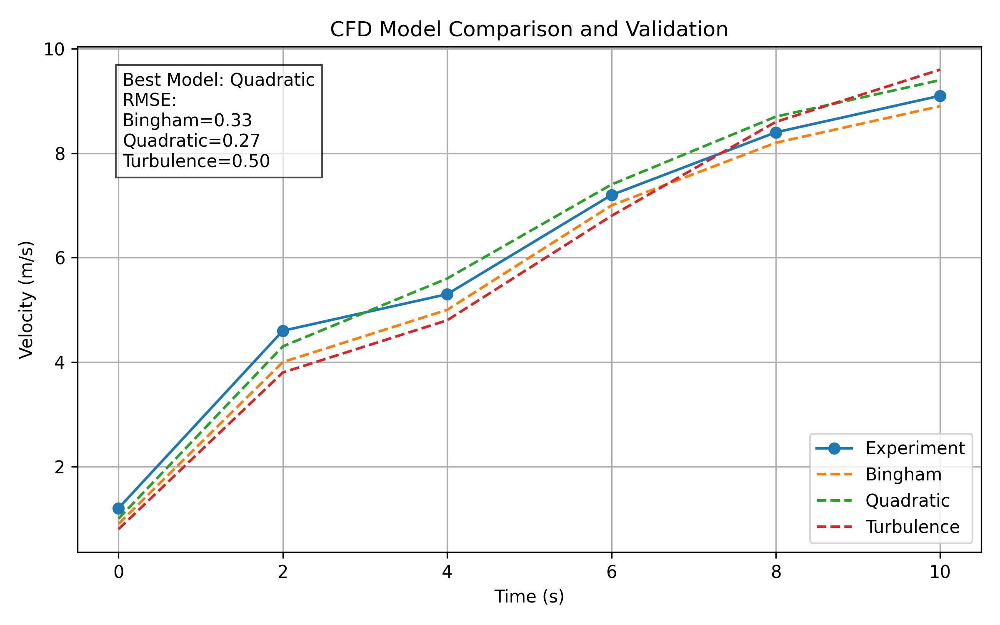

# CFD Model Validation and Comparison

This project evaluates the accuracy of different CFD simulation models by comparing them against experimental velocity data.

The workflow includes data interpolation, error analysis, and model comparison to support engineering decision-making.

---

## 📊 Result

---

## 🧠 Methodology

1. **Data Alignment**
   - Simulation data is interpolated onto experimental time points using linear interpolation.

2. **Error Analysis**
   - The difference between experimental and simulation data is quantified using:
     - Root Mean Square Error (RMSE)

3. **Model Comparison**
   - Multiple CFD models are evaluated:
     - Bingham model
     - Quadratic model
     - Turbulence model

4. **Model Selection**
   - The best-performing model is identified based on minimum RMSE.

---

## 📈 Key Findings

- Quadratic model shows the best agreement with experimental data.
- Bingham model slightly underestimates velocity at early stages.
- Turbulence model shows larger deviation, especially at early time.

---

## 🏗 Engineering Insight

This workflow demonstrates how simulation models can be validated against experimental data and used to support model selection in engineering practice.

Such an approach is commonly used in:
- CFD model validation
- Hydraulic and environmental simulations
- Engineering design decision-making

---

## 🛠 Tools and Libraries

- Python
- NumPy
- Pandas
- Matplotlib

---

## 📂 Project Structure
